# Potato-P1-

## Code Institute - First Milestone Project: User Centric Frontend Development.
# Table of Contents
- [Potato](#Potato-P1-)
  - [Code Institute - First Milestone Project: User Centric Frontend Development.](#code-institute---first-milestone-project-user-centric-frontend-development)
- [Table of Contents](#table-of-contents)
  - [Demo](#demo)
    - [A live demo to the website can be found here](#a-live-demo-to-the-website-can-be-found-here)
  - [UX](#ux)
  - [User stories](#user-stories)
    - [Strategy](#strategy)
    - [Scope](#scope)
    - [Structure](#structure)
    - [Skeleton](#skeleton)
    - [Surface](#surface)
  - [Technologies](#technologies)
  - [Features](#features)
    - [Existing Features](#existing-features)
    - [Features Left to Implement](#features-left-to-implement)
  - [Testing](#testing)
    - [Validator Testing](#validator-testing)
    - [Bugs](#bugs)
  - [Deployment](#deployment)
  - [Credits](#credits)
    - [Content](#content)
    - [Media](#media)
    - [Acknowledgements](#acknowledgements)

## Demo
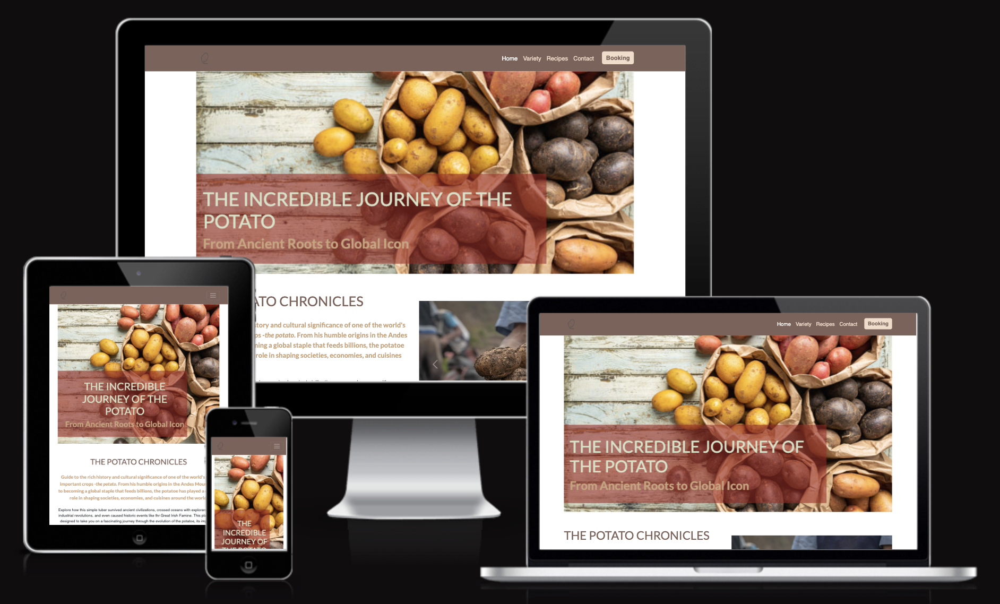
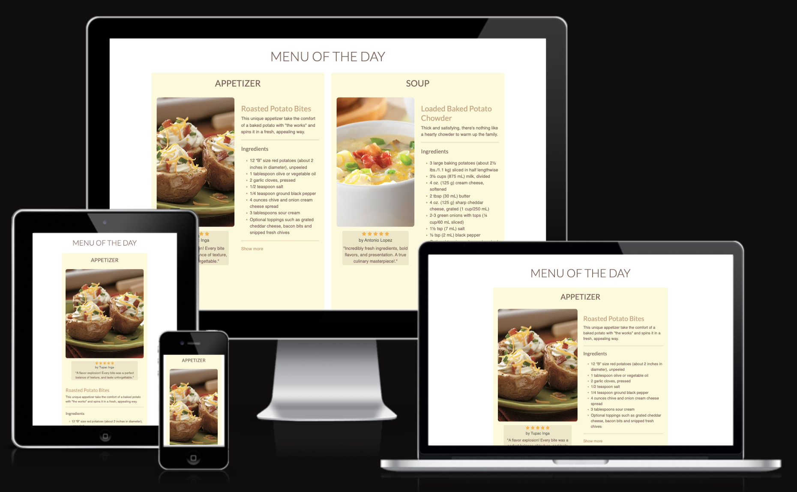

### A live demo to the website can be found [here](https://cynthiapinedoh79.github.io/Potato-P1-/)

## UX
This website is designed for anyone interested in learning more about potatoes, from history and research to purchasing them or taking cooking classes.
Anyone who wants to learn more about potatoes, from history and research, purchasing them or taking cooking classes, will find this website useful.

## User stories
My goal as the sole developer of this website is to give you access to accurate and valuable potatoes information, including their history, diversity, and most commonly used varieties, nutritional value, and recipes.

For users, I have established the following points:

- In my role as a user, I aim to quickly and easily comprehend the purpose of this website.
- I desire to navigate this website effortlessly using a mouse, keyboard, or touchscreen as a user.
- I am seeking high-quality and concise information about potato-related topics as a user.
- As an end user, I am looking for a way to contact this website.

### Strategy
Our objective is to create a website that is both professional and functional. Our focus is on design that is both intuitive and creative.

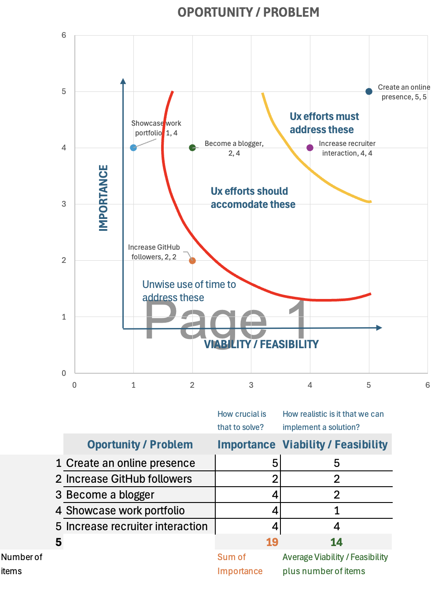

### Scope
The site is targeted towards three primary categories of users: young adults (15-24), adults (25-64) and seniors (65 and older).

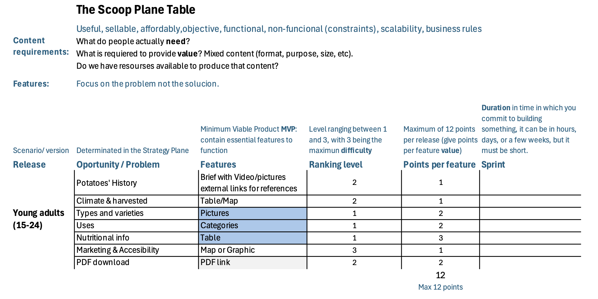

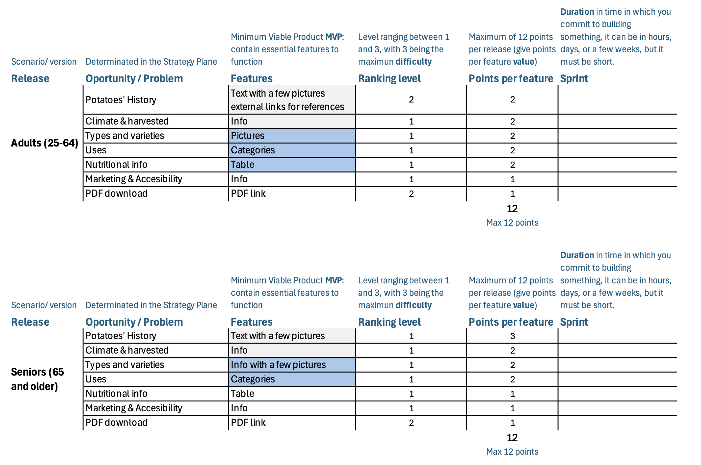

### Structure
The website is designed with 4 pages, with fixed top navigation and redirection to the contact section on the home page from any of them.

**Website Pages:**
1. **_Home:_** Potato's introduction, history and contact section.
2. **_Variety:_** Diverrsity and potatoes variety.
3. **_Recipes:_** Introduction and recipes.
4. **_Booking:_** Map and make an appointment.
6. **_Footer:_** At the bottom of the website with social media links.

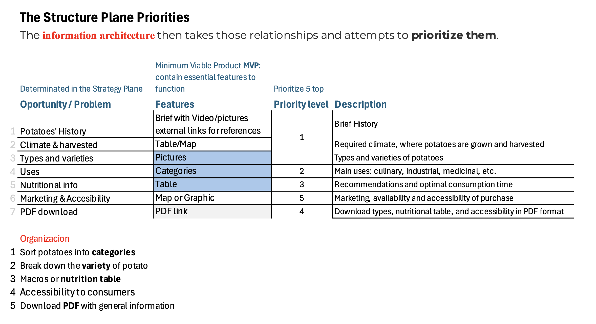

### Skeleton
The website is designed to be clear and simple. And the site has a simple tree structure with hierarchical flows from top to bottom.

**Wireframe**
The wireframe is designed using Balsamiq software. The first draft was edited with the guidance of the mentor. Although the site was built as a single-page scrolling website, the wireframe was designed to focus on each and every section as a single page and connect them using the navigation.

My wireframe design in the [(img png)](assets/images/readme/balsamic.png)

### Surface
To create a pleasing and understandable view, I opt for natural colors such as earth, green, and a range of tones that complement and contrast each other.

[Tested the contrast](https://webaim.org/resources/linkcontrastchecker/)

_Main color palette_

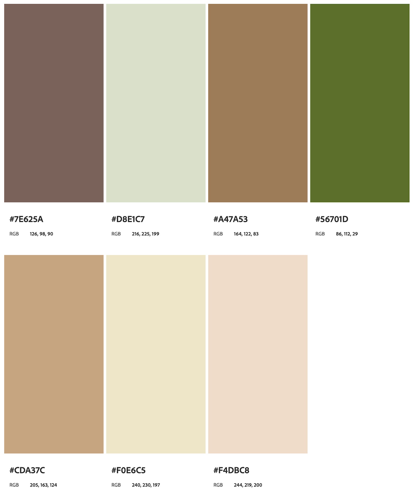

## Technologies
1. HTML - To create a basic site
2. CSS - To create a nice, standout front-end and to give a great user experience
3. Balsamiq - To create a wireframe

## Features
### Existing Features
* **Navigation Bar**
  * The navigation bar is fixed to the right side of the top. The logo is in the left-hand corner of the navigation.
  * The font color is in contrast with the navigation background color. The hover effect is used for navigation, so the user can know which page they are on. 

* **Home**
  - As the background image, we use cover text to welcome to the site.
  - There is a brief introduction and history info.
  

* **Variety**
  * This page display the most commun potatoes types.

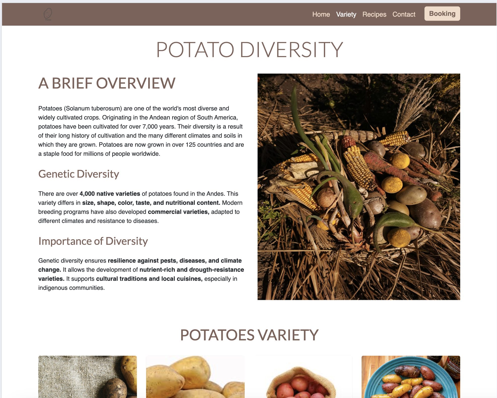

- **Recipes**
  * Recipes using potatoe as first protagonist.
  *This page introduce the chef of the month with a daily different recipe per day, that includes: Appetizer, Soup, Dinner, Dessert and Drink.

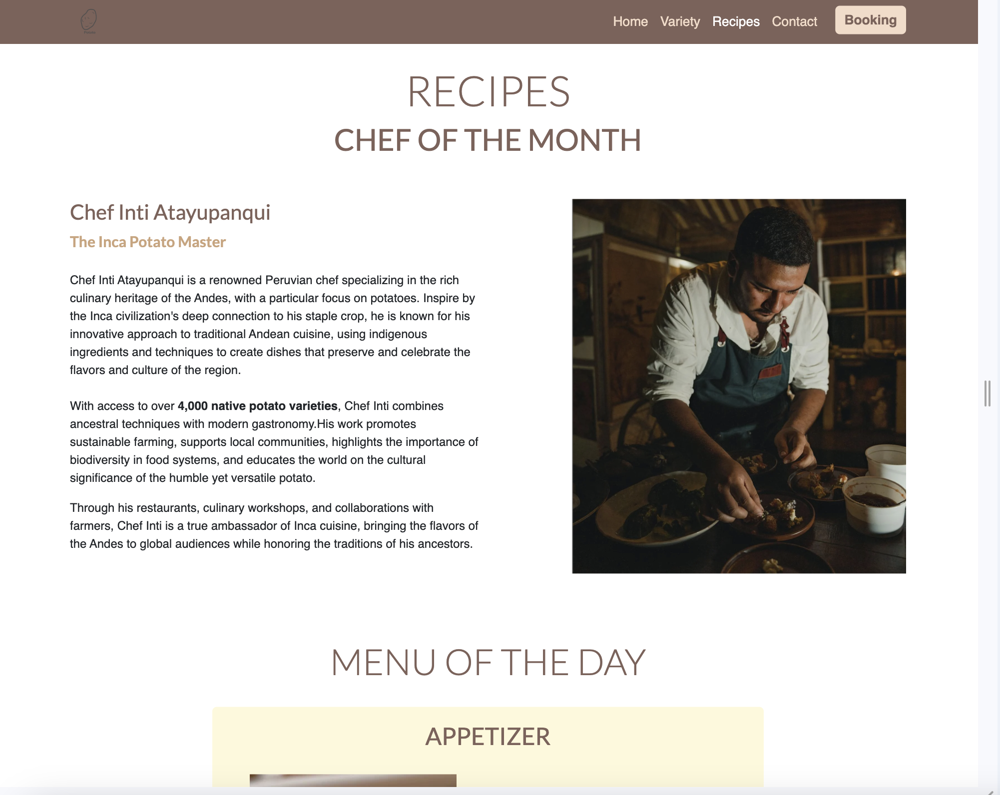

- **Booking**
  - In this section, information is focused on four categories.
  - _Expertise:_ skills that I have learned during the past few years by working in different industries and jobs. I believe that these top few skills that I have listed will help me as a developer in the field of IT.
  - _Language skills (human):_ these are the languages that I am able to use for communication (read, write, and speak).
  - _Tools:_ some technological tools that I am familiar with.
  - _Tech Languages:_ these are some tech languages that I have some basic understanding of and have started to learn deeper with the Code Institute.

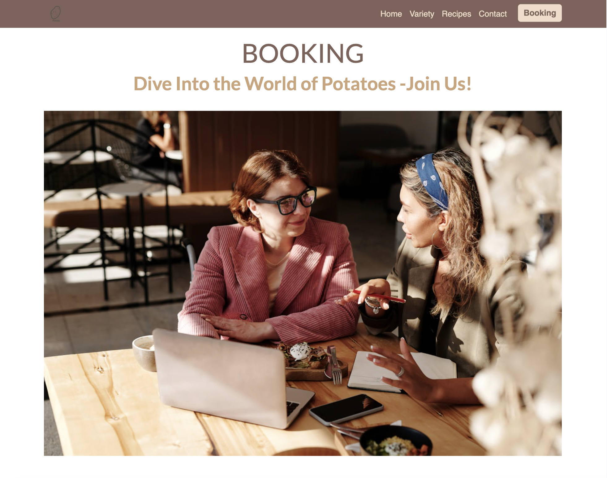

- **Contact**
  - In the Contact Me section, give the user the main contact details that they can use to reach me (Anjalee Kulasinghe). This section is divided into two main sections.
  - On the left-hand side, there is a picture of me, which will help the user remember who I am if they see me in an interview. Below the profile image, my name (first and last names), what positions I am currently capable of, my email address, my mobile number and my postal address are listed. 
  - On the left-hand side, a form is given where the users will have the ability to contact me directly by entering their name and email address along with a message. The user will be asked to include their first name, last name, email, and message. The submit and reset buttons are placed at the end of the form.

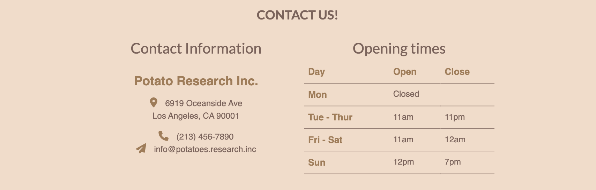

- **Footer**
  - This section includes the social media links.

### Features Left to Implement
Towards the future,
* My objective is to expand the uses of potatoes, beyond their culinary applications, to include industrial uses, which can involve creating plastics, adhesives, paper, and other materials; and medicinal uses that include incorporating them as an ingredient in products designed to alleviate inflammation and minor burns.
* A PDF page that contains nutritional facts for the main types of potatoes would be added, but I left a generalized one because the variation is minimal.
* It would be beneficial to include a page that provides basic information for farmers, including simplified information on the suitable climate and altitude for planting potatoes, as well as their distribution and marketing.
* I would like to improve the performance of the website.

## Testing
* I tested the site, and it works in different web browsers: Chrome, Firefox, Safari and Microsoft Edge.
* On mobile devices, I tested the site on Pixel 7 XL Pro.
* I confirmed that the site is responsive and functions on different screen sizes using the devtools device toolbar.
* I confirmed that the navigation, pages and differents sections are readable and easy to understand.
* I confirmed that the form works: it requires entries in the most important fields, only accepts an email in the email format, and the submit buttons work.

### Validator Testing
* **HTML**
* All pages: Home:index.html, Variety:variety.html, Recipes:recipes.html and Booking:booking.html passed through the official [W3C validator]with no errors. (assets/images/readme/W3C-index.html.png)(assets/images/readme/W3C-variety.html.png)(assets/images/readme/W3C-recipes.html.png)(assets/images/readme/W3C-booking.html.png)

* **CSS**
  CSS:style.css code passed through the official [(Jigsaw) validator]with no errors(assets/css/images/readme/W3C-style.css.png)
  
* **Accessibility**
  I confirmed that the colors and fonts chosen are easy to read and accessible by running it through [Lighthouse DevTools](assets/)

### Bugs
* **Solved bugs**
  * A lot of bugs but all eventually resolved.

## Deployment
* The site was deployed to Git Hub pages using the following steps:
  * In the Github repository, the Stetting tab.
  * Under General, navigate to Code and Automation and select 'Pages'.
  * In the Build and Deployment section for Source, select 'Deploy from a branch' from the drop-down list.
  * For Branch, select 'main' from the drop-down list and Save.
  * On the top of the page, the link to the complete website is provided.
  
  - The deployed site will update automatically upon new commits to the master branch.

## Credits
*Code Institute for example exercises

*pamperedchef.com
*olivado.com
*cuban-recipes/boniatillo
*mybartender.com/recipe

### Content
* I used as example from the Code Institute's [Love Running](https://github.com/Code-Institute-Solutions/love-running-2.0-sourcecode/tree/main) project.
[the last one](https://github.com/Code-Institute-Solutions/love-running-2.0-sourcecode/tree/main) project.

### Media
Images from [Images](https://www.pexels.com/).

### Acknowledgements
* Ideas were taken from the Code Institute's Coffee House and Love Running projects.
* The the Code Institute tutor support team for helping me with the correct guidance.
* My mentor, Medale Oluwafemi, for his meanful advices.